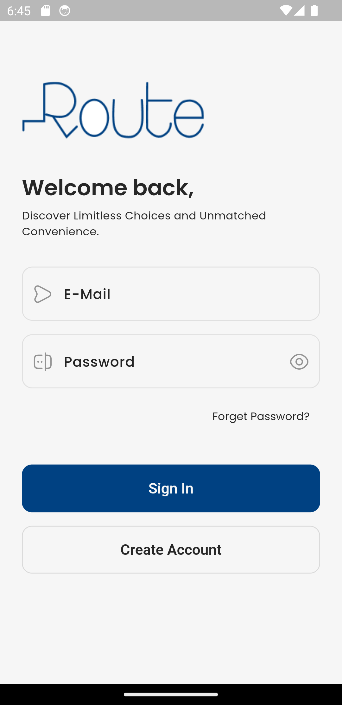
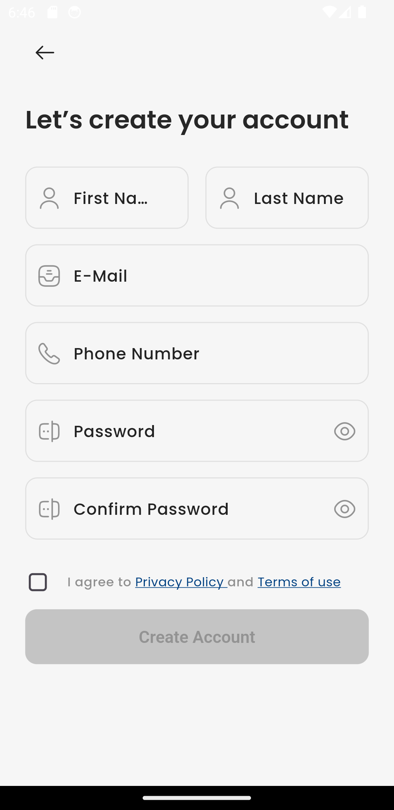
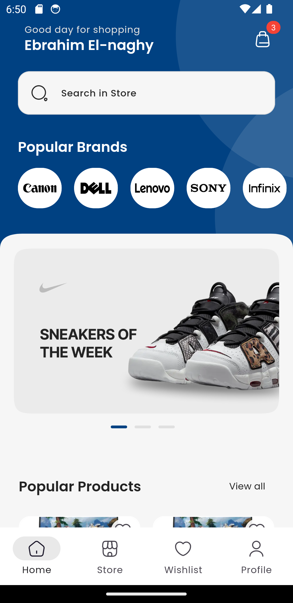
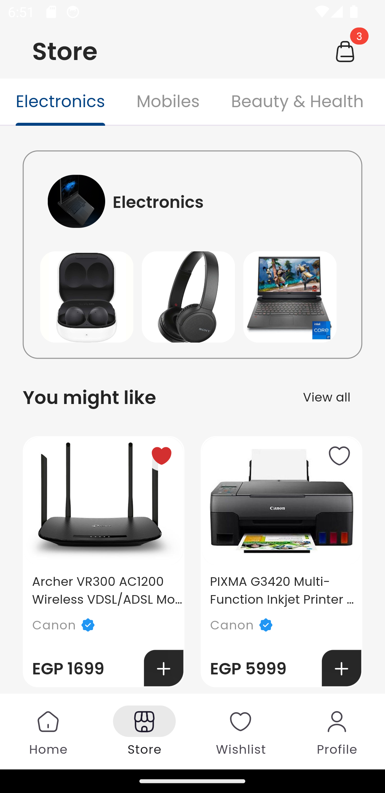
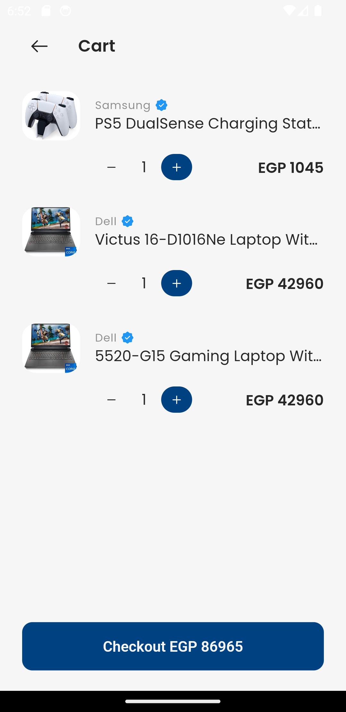
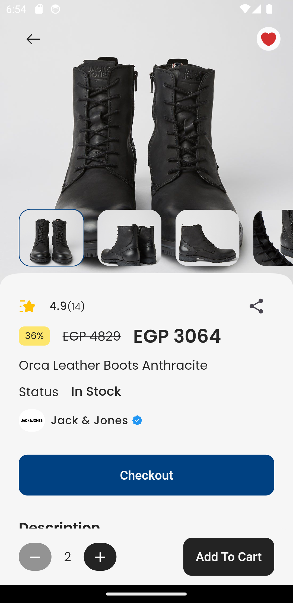
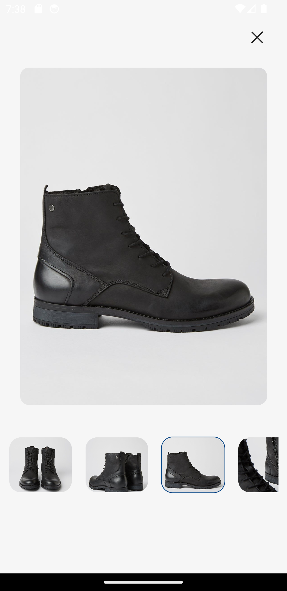

# Route Store

Route Store is a mobile application built with Flutter that provides a seamless shopping experience for users. It allows users to browse through a variety of products, add them to their cart, and make purchases securely. The app is designed to be intuitive and user-friendly, with a clean interface and smooth navigation.

## Features

- **User Authentication**: Allow users to sign up, sign in, and manage their accounts securely.
- **Product Browsing**: Browse through a wide range of products categorized into various sections.
- **Product Details**: View detailed information about each product, including images, description, price, and reviews.
- **Shopping Cart**: Add products to the cart and manage them before proceeding to checkout.
- **Checkout Process**: Securely complete the purchase with multiple payment options and shipping addresses.
- **Order History**: View past orders and track their status.

## Screenshots

## Technologies Used

- **Flutter**: Cross-platform UI toolkit for building natively compiled applications.
- **Dio**: HTTP client for making network requests.
- **Get It**: Dependency injection package for managing dependencies efficiently.
- **Injectable**: Convenient code generation for dependency injection.
- **Shared Preferences**: Persistent storage for storing key-value pairs locally.
- **Bloc**: State management library for managing application state.
- **Flutter Bloc**: Flutter-specific implementation of the BLoC pattern.
- **Carousel Slider**: Widget for implementing carousel-style scrolling.
- **Flutter Rating Bar**: Widget for displaying and collecting ratings from users.
- **Cached Network Image**: Widget for displaying images from the internet with caching support.
- **Shimmer**: Package for implementing shimmer effect placeholders for loading content.
- **Lottie**: Library for including  animations in Flutter apps.
